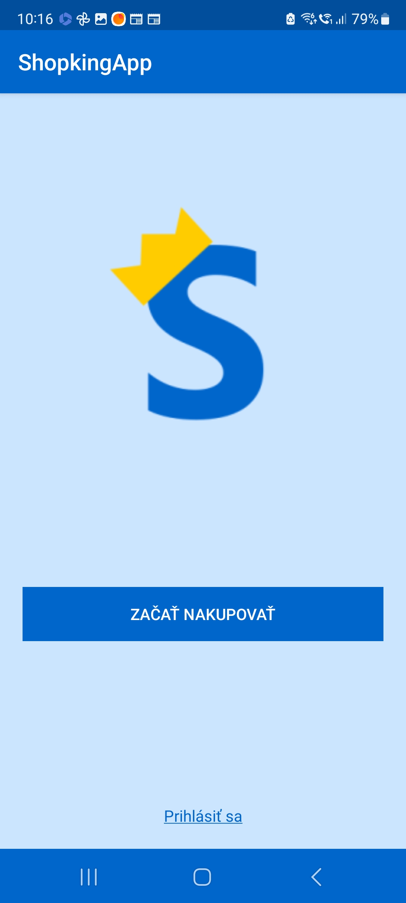
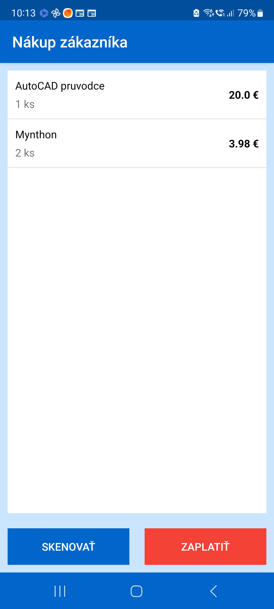
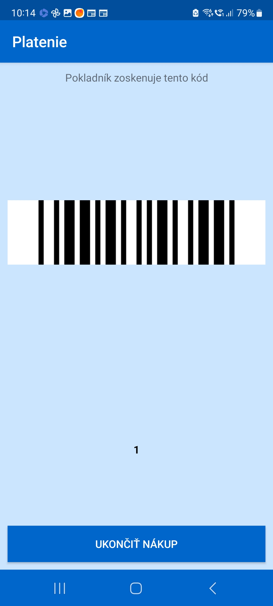

# ShopkingApp
Aplikácia pre Shopking pokladničný systém.

Táto aplikácia má momentálne 2 použitia:
- čítačka čiarových kódov pre pokladníka ako náhrada za normálnu čítačku kódov
- nákupný systém pre zákazníka (podobný službe Scan&Shop)

> Pozn.: Aplikácia vyžaduje, aby bola zapnutá v tej istej stieti ako je server s databázou a zároveň aby bol tento server spustený.

## Čítačka čiarových kódov pre pokladníka
Ako je napísané v úvode, prvé použitie tejto aplikácie je náhrada čítačky čiarových kódov pre pokladníka. Pokladník sa musí najprv do aplikácie prihlásiť pomocou používateľského mena a hesla, ktoré používa pri prihlasovaní do pokladničného rozhrania.

> Upozornenie: Pokladník musí byť v čase prihlasovania do aplikácie už prihlásený k pokladničnému rozhraniu na akejkoľvek pokladni.

## Nákupný systém pre zákazníka
Tento systém funguje podobne ako služba Scan&Shop v obchodnom reťazci Tesco. Nakupujúci len skenuje čiarové kódy produktov, ktoré chce nakúpiť a pri platení v pokladni len ukončí v aplikácií nákup, aplikácia mu vygeneruje čiarový kód, ktorý dá oskenovať pokladníkovi a tým sa pokladníkovi importuje celý nákup, ktorý zákazník vytvoril. Pokladník už môže robiť to isté, ako pri obyčajných nákupoch.

> Upozornenie: Zákazník musí byť v čase používania aplikácie pripojený k sieti, v ktorej sa nachádza server s databázou.

## Ukážky

